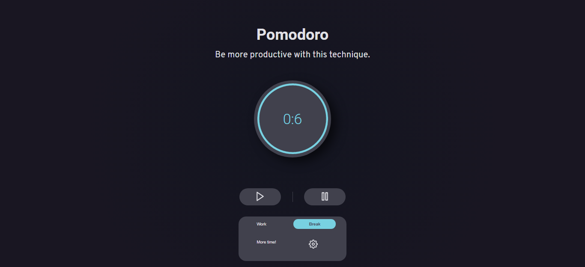

## | Intro

The Pomodoro Technique is a time management method developed in the late 1980s. The technique consists of using a stopwatch to divide work in periods, the recomended is 25 minutes per "round" with small intervals. I maked this project with two options of interval, you select one option for small interval e other option for most time.

## 🚀 | Tools

- [React](https://reactjs.org)

I used also figma for design.

## 💻 | Layout

Interesting to note some details of the project in operation. I took care so that the timer had a smooth effect over time, as time decreases it changes the color.

  
  
  

